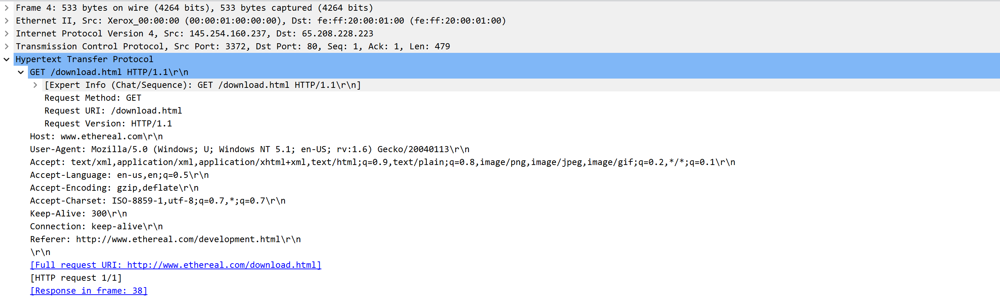
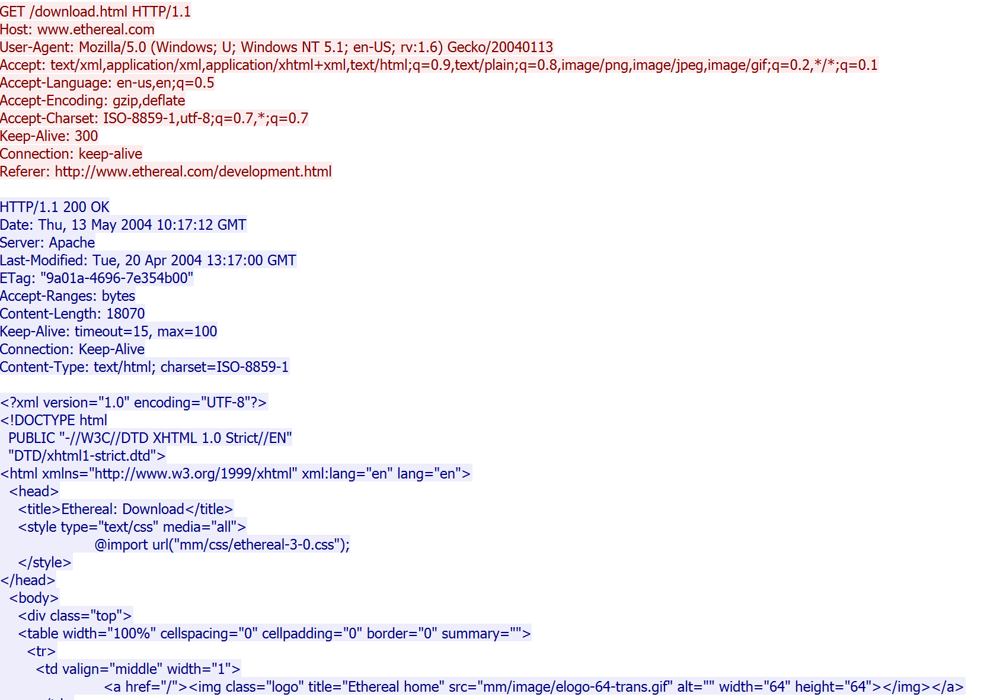
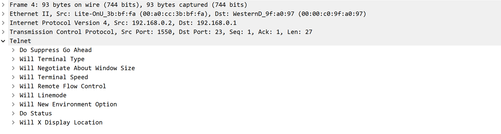
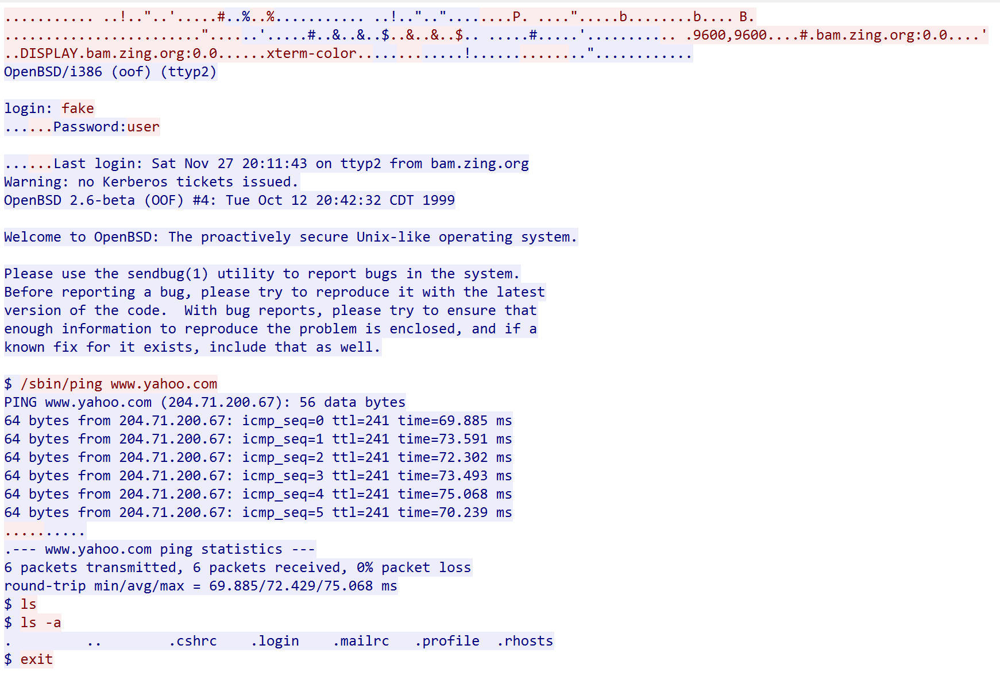
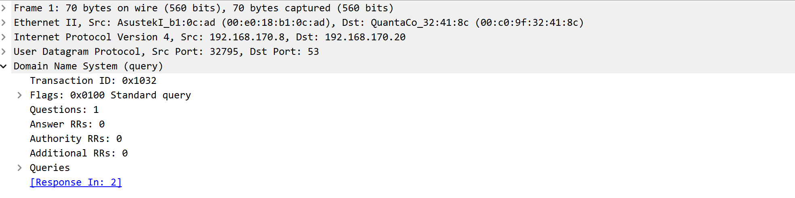
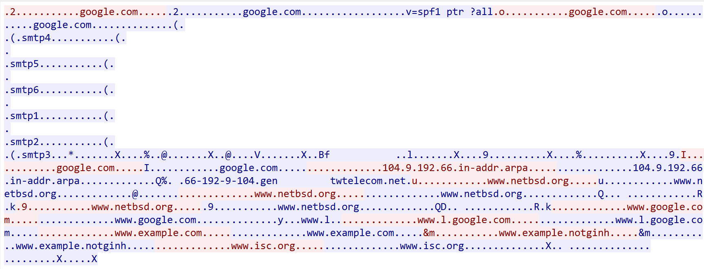

`Tugas ini merupakan tugas mata kuliah konsep jaringan  yang di bimbing oleh Bpk. Ferry Astika S`

## Analisis http.cap, telnet-cooked.cap dan dns.cap pada Wireshark
---

### Analisis HTTP

 
Hypertext Transfer Protocol(HTTP) adalah protokol yang digunakan untuk mengirimkan data antara client dan server di world wide web(www). Protokol ini menjadi dasar untuk pertukaran informasi di web, dan digunakan untuk mengambil halaman web, gambar, video, dan sumber daya web lainnya dari server web ke perangkat pengguna. HTTP adalah protokol berbasis teks yang berjalan di atas protokol TCP dan menggunakan metode seperti GET, POST, PUT dan DELETE.

File http.cap adalah sampel trace file yang dapat diunduh dari website resmi wireshark.
  

<i>Gambar: Detail dari sebuah paket HTTP pada file http.cap</i>

 

Dari detail yang ditampilkan oleh wireshark, dapat diketahui bahwa:
- IP client: 145.254.160.237
- IP Server: 65.208.228.223

Pada paket HTTP, jika diklik kanan maka akan ada pilihan *follow -> HTTP stream* yang mana akan membuka pop-up window sebagai berikut:

<i>Gambar: HTTP stream</i>

 

Pada Wireshark, dapat dilihat aliran dari suatu protokol komunikasi yang digunakan. Pada gambar diatas dapat pilihat aliran HTTP dimana client(merah) mengirim sebuah request kepada server dan server(biru) membalas dengan data yang diminta oleh client.

---
### Analisis Telnet
 
Telecommunication network(Telnet) adalah protokol aplikasi yang digunakan di Internet atau jaringan area lokal untuk menyediakan fasilitas komunikasi berorientasi teks interaktif dua arah menggunakan koneksi terminal virtual. Telnet dalam koneksi data berorientasi 8-bit melalui Transmission Control Protocol (TCP).
Telnet Sendiri terdiri dari dua bagian:

1. Protokol itu sendiri yang menspesifikkan bagaimana cara komunikasi dari kedua pihak, dan
2. aplikasi perangkat lunak yang menyediakan layanannya.

File telnet-cooked.cap adalah sampel trace file yang dapat diunduh dari situs resmi Wireshark dan dibuka menggunakan aplikasi Wireshark.
 

<i>Gambar: Detail dari sebuah paket Telnet pada file telnet-cooked.cap</i>

 
Dari gambar di atas, dapat dilihat bahwa:

- alamat IP client adalah 192.168.0.2,
- alamat IP server adalah 192.168.0.1, dan
- bahwa Telnet menggunakan TCP sebagai protokolnya.
 

<i>Gambar: TCP stream pada Telnet</i>

 
Jika diperhatikan, pada aliran TCP dari Telnet dapat dilihat bahwa terjadi komunikasi dua arah antara client dan server dimana server(biru) meminta kredensial login dan client(merah) mebalas dengan data yang diminta, barulah server memberikan data yang diminta oleh client sebelumnya.

---
### Analisis DNS

DNS adalah sistem yang digunakan untuk menerjemahkan nama domain yang mudah diingat (misal www.abc.com) ke alamat IP yang sesuai yang diperlukan oleh komputer untuk mengidentifikasi server di internet. DNS adalah bagian kunci dari infrastruktur internet dan memungkinkan kita untuk menggunakan nama alamat yang lebih mudah diingat daripada alamat IP numerik yang rumit.

File dns.cap adalah sampel trace file yang dapat diunduh dari situs resmi Wireshark dan dibuka menggunakan aplikasi Wireshark.
 

<i>Gambar: Detail dari sebuah paket DNS pada file dns.cap</i>

 

Dari gambar di atas, dapat dilihat bahwa:
- alamat IP client adalah 192.168.170.8,
- alamat IP server adalah 192.168.170.20, dan
- bahwa Telnet menggunakan protokol UDP.
 

<i>Gambar: UDP stream pada DNS</i>

 
Ketika membuka aliran UDP dari file dns.cap, seperti pada aliran TCP, dapat dilihat komunikasi antar client(merah) dan server(biru).