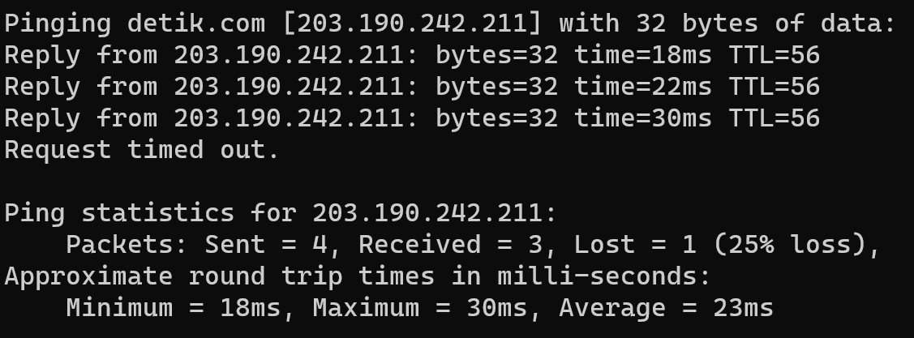
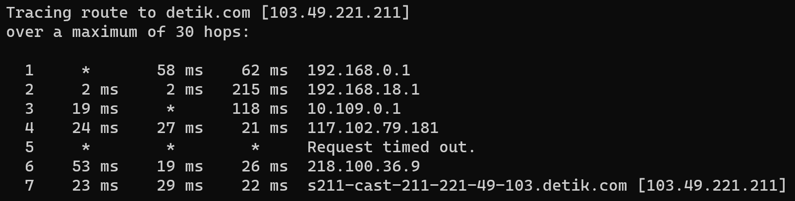

## Ping dan Traceroute
---

### Ping

 
Ping, berasal dari istilah Packet Internet Network Groper, adalah sebuah perintah atau utilitas yang digunakan dalam jaringan komputer untuk mengukur waktu yang diperlukan untuk mengirimmkan paket data dari satu titik ke titik lain dalam jaringan, juga untuk memastikan ketersediaan atau keberadaan dari host atau server yang dituju, serta untuk melihat kuatilas koneksi internet user berdasarkan hasil respon ping yang diterima. Secara singkat, ping adalah perintah yang berfungsi untuk mengecek status dan keberadaan host dalam sebuah jaringan internet.
 
Cara kerja ping adalah saat perintah ping dieksekusi, komputer akan mengirim paket ICMP(Internet Control Message Protocol) ke alamat tujuan. Ketika perangkat tujuan menerima paket, ia akan mengirimkannya kembali ke pengirim awal. Dari situ komputer pengirim akan mengukur waktu yang dibutuhkan untuk paket data pergi dan kembali yang disebut RTT(Round Trip Time).
  

<i>Gambar: Contoh hasil penggunaan perintah ping</i>

 
Hasil dari ping menunjukkan balasan dari server yang terdiri dari byte, waktu, dan TTL dan biasanya dikirim sebanyak empak kali, sehingga memberikan empat baris balasan, diikuti dengan statistik dari ping berupa jumalh paket yang dikirim, jumlah paket yang diterima, dan jumlah paket yang hilang saat proses serta waktu RTT maksimum, minimum, dan rata-rata.
 

---

### Traceroute

 
Traceroute digunakan untuk mengetahui rute yang dilewati suatu paket dari sumber hingga mencapai tujuan. Perintah tracert digunakan untuk melakukan traceroute mealalui cmd secara real time. Ini membantu mengidentifikasi semua perangkat jaringan (router atau hop) yang dilewati oleh paket data saat melakukan perjalanan dari sumber ke tujuan.

 

Cara kerja dari traceroute adalah pada saat perintah tracert dieksekusi dengan menentukan alamat tujuan, komputer yang digunakan akan mengirim serangkaian paket data dengan TTL(Time to Live) yang semakin besar. TTL ini diatuur untuk mencegah paket tetap berputar di jaringan selamanya. Saat paket mencapai router atau hop dalam perjalanan, TTL dikurangi sebangak satu satuan. Setiap router atau hop yang menerimapaket dengan TTL habis akan merespon dengan mengirimkan pesan TTL expired. Dari situ komputer pengirim mengumpulkan respons dari setiap hop dan mengidentifikasi hop yang dilewati oleh paket data saat perjalanan dari sumber ke tujuan.

 

Hasil yang didapat dari perintah tracert adalah:
- Nomor Hop: yang menandakan hop keberapa yang dilewati pada baris tersebut.
- RTT(Round Trip Time): Merepresentasikan waktu yang dibutuhkan untuk setiap paket untuk mencapai sebuah alamat IP dan mengembalikannya ke komputer pengguna. Secara deafult traceroute mengirimkan tiga paket sehingga RTT juga berjumlah tiga.
- IP/Host: menunjukkan alamat IP atau nama host yang dilewati pada hop tersebut.
 

<i>Gambar: Contoh hasil penggunaan perintah traceroute</i>

 
Pada kasus tertentu, dapat terjadi suatu masalah saat melakukan hop, dimana pada hasil traroute akan menunjukkan pesan error. Terdapat tiga macam eror yang sering ditemui yaitu requst timed out-biasanya terjadi karena masalah jaringan, asterik di kolom RTT-menandakan kegagalan mengembalikan respon dalam waktu yang diberikan, dan destination net unreachable-dimana memberitahukan kegagalan dalam menemukan rute menuju alamat tujuan sehingga berhenti bregerak.