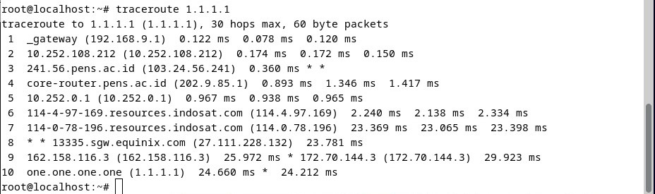
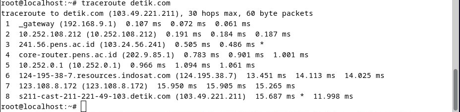

`Tugas ini merupakan tugas mata kuliah konsep jaringan  yang di bimbing oleh Bpk. Ferry Astika S`

# Traceroute 1.1.1.1 dan detik.com
## Traceroute 1.1.1.1

 

- gateway (192.168.9.1)
  Langkah pertama melalui gateway dengan alamat IP 192.168.9.1. Waktu respons sangat rendah, menunjukkan bahwa perjalanan berlangsung dengan cepat.
- 10.252.108.212
  Setelah melewati gateway lokal, paket menuju alamat 10.252.108.212 dengan latency yang rendah. Alamat ini mungkin adalah jaringan lokal atau jaringan penyedia layanan.
- 241.56.pens.ac.id (103.24.56.241)
  Ada satu hop yang tidak merespons (*) saat mencoba menghubungi alamat IP 103.24.56.241. Ini bisa disebabkan oleh aturan firewall yang memblokir permintaan traceroute.
- core-router.pens.ac.id (202.9.85.1)
  Setelah hop yang tidak merespons, perjalanan dilanjutkan ke core-router.pens.ac.id dengan latency yang cukup konsisten.
- 10.252.0.1 (10.252.0.1) 0.967
  Paket kemudian melewati alamat IP 10.252.0.1 dengan waktu respons yang relatif rendah.
- 114-4-97-169.resources.indosat.com (114.4.97.169)
  Selanjutnya, paket melewati sumber daya dari Indosat dengan latency yang masih dapat diterima.
- 114-0-78-196.resources.indosat.com (114.0.78.196)
  Perjalanan dilanjutkan melalui sumber daya Indosat dengan waktu respons yang sedikit lebih tinggi.
- 13335.sgw.equinix.com (27.111.228.132)
  Paket mencapai sebuah titik di Equinix, yaitu sebuah pusat pertukaran data internasional. Latency meningkat sedikit, tetapi masih dalam kisaran yang dapat diterima.
- 162.158.116.3 (162.158.116.3)
  Perjalanan dilanjutkan melalui beberapa hop di dalam jaringan Cloudflare (menggunakan alamat IP 162.158.116.3 dan 172.70.144.3).
- one.one.one.one (1.1.1.1)
  Ppaket mencapai tujuan, yaitu 1.1.1.1, yang merupakan layanan DNS publik milik Cloudflare.

## Traceroute detik.com

 

- gateway (192.168.9.1)
  Langkah pertama melalui gateway dengan alamat IP 192.168.9.1. Waktu respons sangat rendah, menunjukkan bahwa perjalanan berlangsung dengan cepat.
- 10.252.108.212
  Setelah melewati gateway lokal, paket menuju alamat 10.252.108.212 dengan latency yang rendah. Alamat ini mungkin adalah jaringan lokal atau jaringan penyedia layanan.
- 241.56.pens.ac.id (103.24.56.241)
  Kemudian paket menuju ke alamat 103.24.56.241, yang berupa server di pens.ac.id. Waktu respons rendah, tapi terdapat satu waktu respons yang tidak terukur (*) pada pengukuran kedua.
- core-router.pens.ac.id (202.9.85.1)
  Paket bergerak ke core-router.pens.ac.id dengan waktu respons yang konsisten dan rendah.
- 10.252.0.1 (10.252.0.1) 
  Alamat IP 10.252.0.1 menjadi langkah selanjutnya dalam perjalanan paket, dengan waktu respons yang konsisten.
- 124-195-38-7.resources.indosat.com (124.195.38.7)
  Paket kemudian mencapai sumber daya yang berasal dari Indosat dengan alamat IP 124.195.38.7. Waktu respons sedikit lebih tinggi, yang mungkin disebabkan oleh kepadatan lalu lintas.
- 123.108.8.172
  Alamat 123.108.8.172 menjadi langkah berikutnya dalam perjalanan paket, dengan waktu respons yang konsisten.
- s211-cast-211-221-49-103.detik.com (103.49.221.211)
  Paket mencapai detik.com dengan alamat IP 103.49.221.211. Waktu respons tercatat, mdengan satu waktu respons yang tidak terukur.