## Analisisi Flowgraph Requst HTTP
Flow graph dapat dilihat melalui Statistics->Flow graph. Flow graph ini berfungsi untuk menampilkan koneksi yang terjadi diantara client dan server disertai dengan detil waktu dan arah komunikasinya, dari awal dibuatnya koneksi hingga penutupan koneksi.

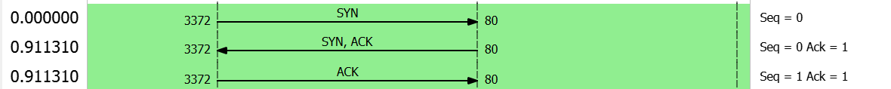

*Connection Establishment*
- Pada detik 0.0000 dapat dilihat bahwa client mengirimkan segment SYN dengan seq(sequence) number 0 untuk mengawali proses three-way handshake.
- Pada detik ke 0.9113, server membalas client dengan segment SYN-ACK ddengan seq number 0 dan ack(acknowledgement) number 1, menandakan bahwa server menyetujui adanya koneksi dan meminta client untuk mengirim segmen berikutya dengan seq number 1. Dibalas kembali oleh client dengan segment ACK dengan seq number dan ack number 1 yang menyatakan terbukanya sebuah koneksi.

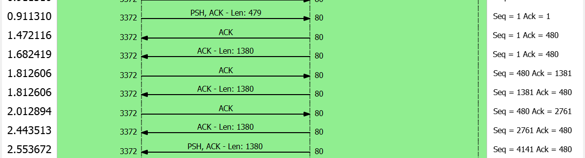

*Data Transfer*
- Pada detik ke 0.9113, dapat dilihat client mengirimkan segemnt berukuran 479 bits dengan PSH flag yang menginformasikan kepada server untuk mengirim data kepada client serta ack bernilai 1 yang menyatakan bahwa seq number yang diekspektasikan untuk dikirim oleh server berikutnya bernilai 1.
- Pada detik ke 1.4721, server mengirimkan 2 bagian kepada client dengan seq number 1 seukuran 1380 bits dan ack number 480. Ini berarti server berkspektasi bahwa client akan mengirimkan segment dengan seq number 480 setelah ini karena sebelumnya telah mengirimkan segment berukuran 479 bits.
- Pada beberapa detik berikutnya, terjadi proses transfer data secara terus-menerus dengan tata cara yang sama.

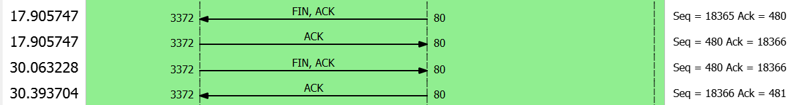

*Connection Termination*
- Pada detik ke 17.9057 dapat dilihat server mengirimkan ke client sebuah FIN flag dengan seq number 18365 dan ack number 480. FIN flag ini menandakan dimulainya proses pemutusan koneksi.
- Pada detik yang sama, dilihat client mengirimkan segment dengan ACK flag yang mennadakan bahwa FIN flag sudah ditemira dan akan dijalankan proses pemutusan koneksi dimana berikutnya client juga harus mengirimkan sebuah FIN flag kembali.
- Pada detik ke 30.0632, dapat dilihat client mengirimkan FIN yang memberitahukan ke server akan dilakukannya pemutusan koneksi balik oleh client.
- Pada detik ke 30.3937, server merespon dengan ACK dimana server menyatakan bahwa FIN flag dari client telah diterima dan diakhirinya proses pemutusan koneksi.

## Packet Counter
Packet counter digunakan untuk menghitung jumlah packet total yang ditangkap selama sesi tertentu. Packet counter ini berfungsi untuk melacak seberapa banyak data yang telah ditangkap dan mengukur lalu lintas jaringan. 

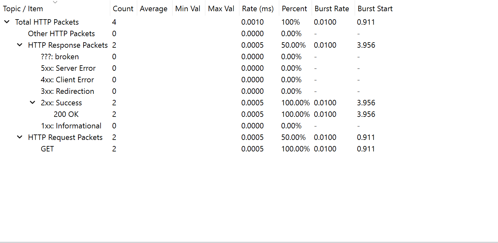

Informasi yang ditampilkan berupa jumlah pakcket diterima, laju masuk paket, burst rate, dan burst start. Selain itu, dapat dilihat pula requst menthod yang digunakan(seperti GET, POST, PUT, dsb) dan juga jenis respons yang diterima seperti Informational, Success, REdirection, Client Error, Server Error, dsb.

## Throughput
Throughput adalah seberapa banyak data yang berhasil ditransfer antara dua titik dalam jaringan dalam satu periode waktu tertentu. Throughput dapat diukur dalam bit per swecond(bps) atau kilobit per second (Kbps), megabit per second (Mbps), atau gigabit per second (Gbps) tergantung pada skala jaringan yang digunakan.

Grafik throughput dapat dilihat melalui wireshak menggunakan Statistics -> TCP Stream Graphs -> Throughput.

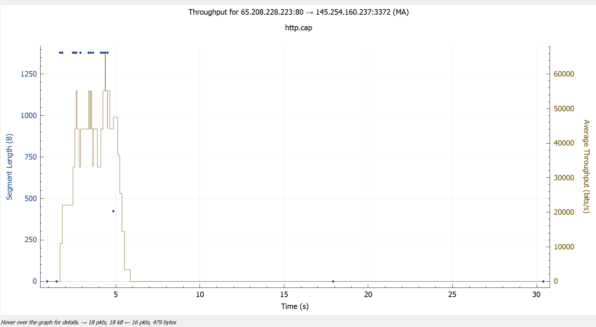

Pada grafik thoughput, sumbu horizontal menunjukkan waktu dan sumbu vertikal menunjukkan ukuran packet(biru) dan throughput(kuning). Puncak pada throughput menunjukkan saat ketikat lalu lintas jaringan mencapai tingkat tertinggi sedangkan adanya lembah dapat menunjukkan penurunan. Sebuah penurunan besar yang terjadi secara terus-menerus dapat menandakan adanya bottleneck.

## http-with-jpegs.cap
File http-with-jpds.cap menyimpan beberapa file gambar JPEG JFIF. GAmbar ini dapat ditangkap dengan beberapa langkah berikut.
1. Unduh file http-with-jpegs.cap dan buka menggunakn wireshark.
2. Cari panket dengan protokol HTTP. Untuk melakukan ini dapat menggunakan filter sehingga tidak perlu memilah secara manual dari ratusan paket yang ada.

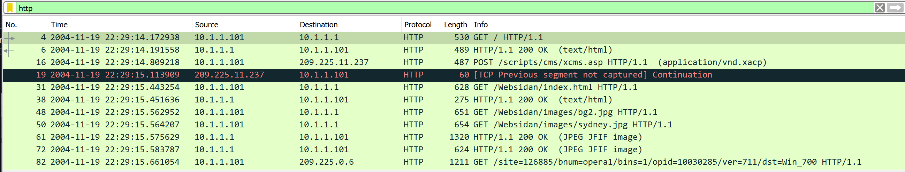

3. Cari paket yang pada kolom infonya tertera "HTTP 1.1 200 OK JPEG JFIF image".
4. Klik kanan pada JPEG File Interchange Format dan pilih Show Packet Bytes.

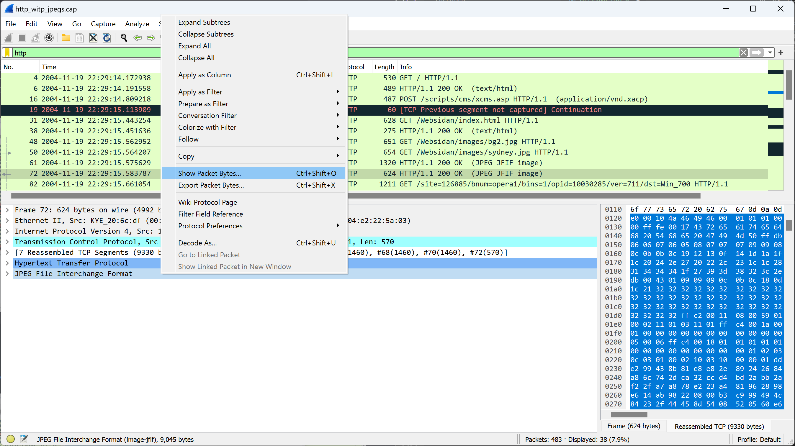

Gambar pada packet akan muncul.

### GAmbar yag terdapat pada http-with-jpegs.cap

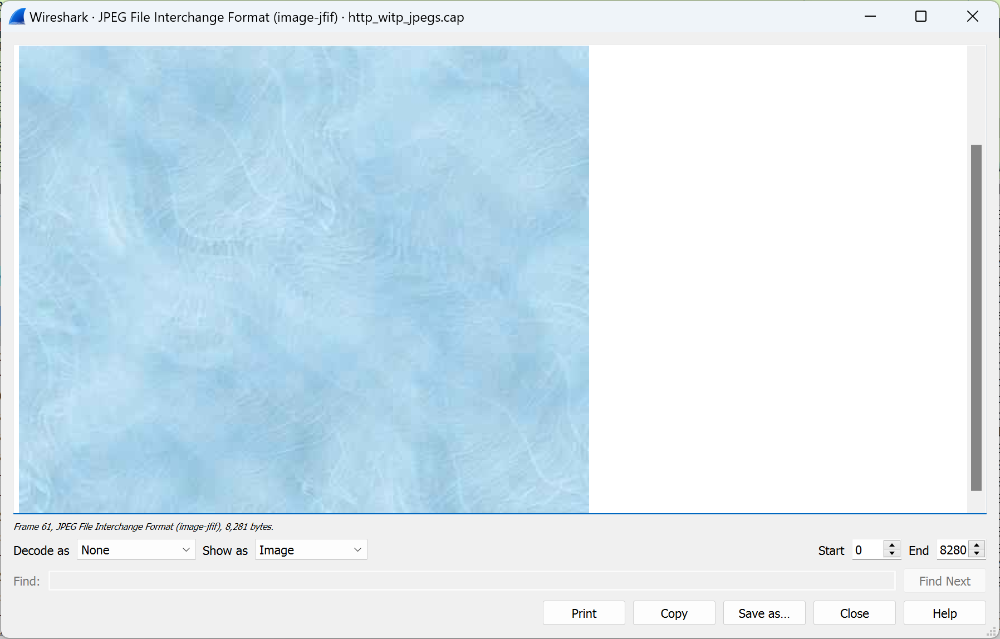
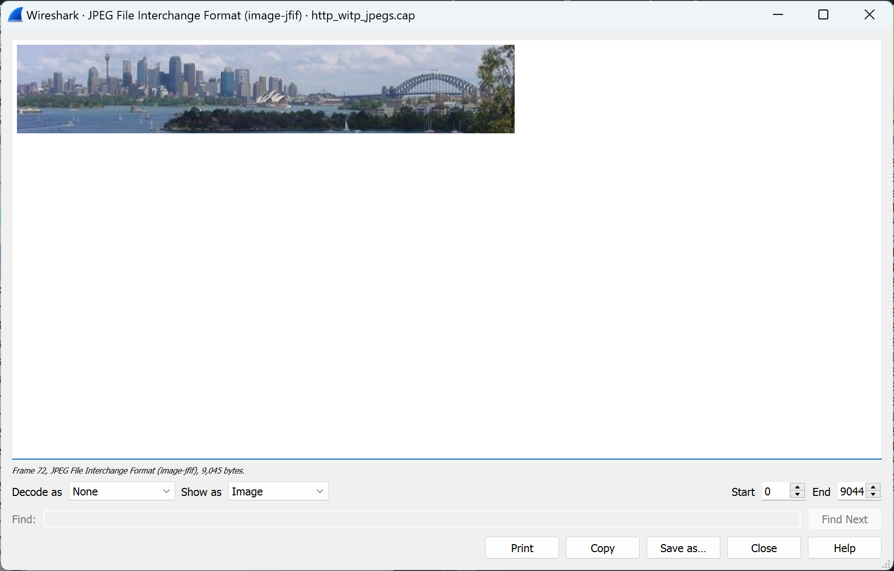
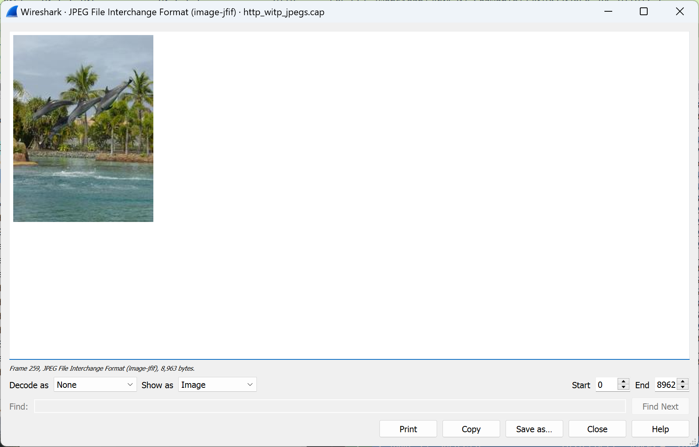
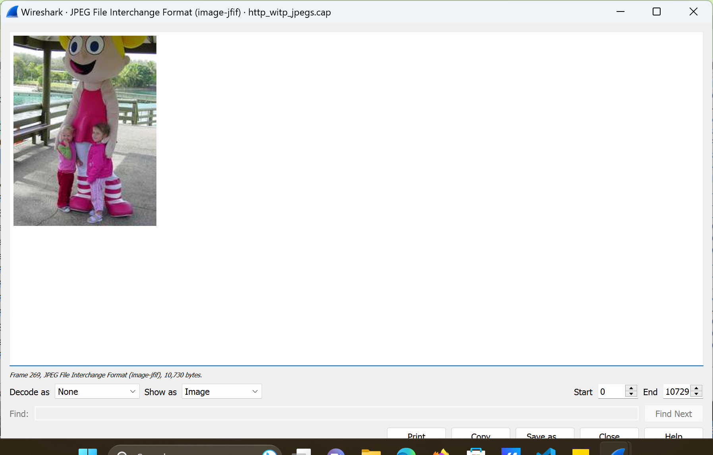
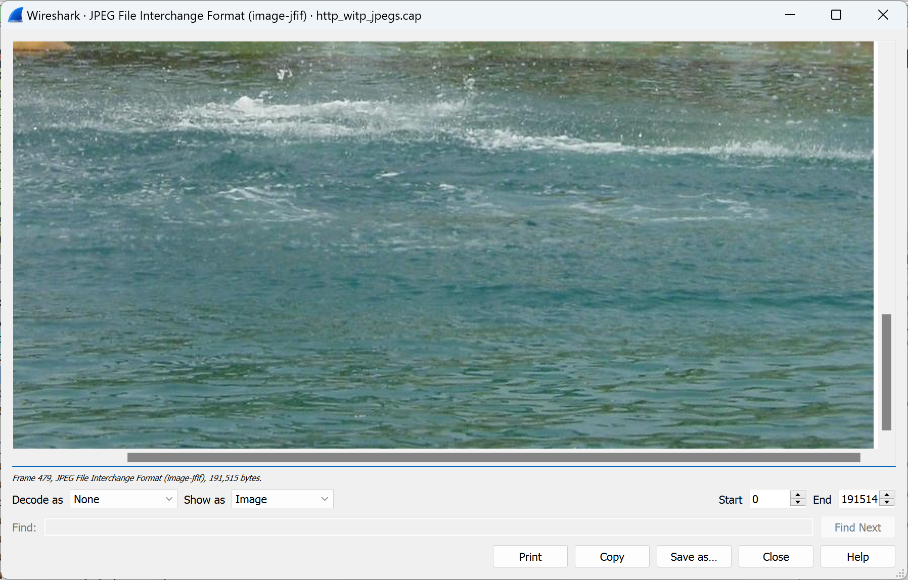

