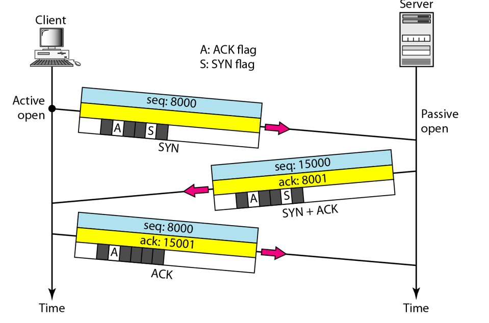

## TCP Three-Way Handshake

TCP(Transmission Control Protocol)

Three-way handshake sendiri adalah proses yang digunakan pada TCP untuk memulai koneksi antara client dan server. Tujuan dari proses ini adalah untuk mengatur parameter awal dari komunikasi yang akan datang dan memastikan bahwa kedua pihak(client dan server) sepakat untuk memulai koneksi. Disebut three-way karena proses ini melibatkan tiga langkah yang dilakukan untuk terbentuknya koneksi yang sukses.
 

<i>Gambar: Ilustrasi dari proses pembuatan koneksi TCP dengan Three-Way Handshake</i>

 

Ketiga langkah tersebut sebagai berikut:
1. SYN(Synchronize)
Dimulai dengan client megirimkan sinyal SYN ke server untuk memulai permintaan koneksi. Paket SYN yang dikirimkan oleh client mengandung sebuah seq(sequence) number yang digunakan sebagai nomor urut awal yang nantinya akan digunakan untuk mengatur aliran data.
 
2. SYN-ACK(Synchronize-Acknowledge)
Server menerima paket SYN dari client dan membalasnya dengan mengirimkan paket SYN-ACK yang berisi seq number dari server dan seq number dari clinet ditambah 1(ack number).
 
3. ACK(Acknowldege)
Client menerima paket SYN-ACK dari server dan akan membalasnya dengan paket ACK  yang berisi seq number client beserta ack number(seq number server ditambah 1).
 

Jika ketiga langkah dari proses three-way handshake selesai, koneksi dianggap berhasil didirikan dan data dapat mulai dikirim antara server dan client dalam sebuah aliran dua arah yang aman. Proses ini memastikan bahwa antar client dan server saling mengenal dan parameter koneksi, seperti seq number, telah diatur dengan benar. Hal ini dapat membantu dalam mendeteksi awal masalh atau kegagalan dalam pembangunan koneksi.