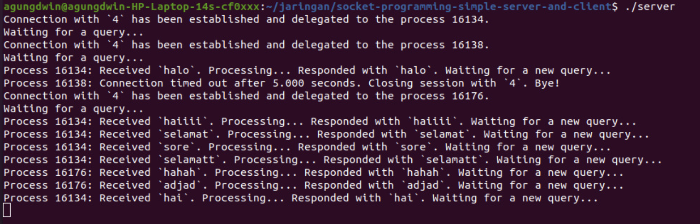

## Socket Server dan Client

### Socket Programming
Socket merupakan teknologi yang digunakan dalam komunikasi jaringan komputer yang memungkinkan komputer untuk berkomunikasi satu sama lain melalui sebuah jaringan. Socket programming sebdiri adalah portokol yang mempunyai metode untuk membuat koneksi tersebut. Tujuan dari socket programming adalah agar satu program bisa berinteraksi dengan program lainnya melalui jaringan menggunakan socket.

Socket programming dapat menggunakan protokol yang berbeda tergantung dengan jenis komunikasi yang dilakukan. Dua Protokol yang paling umum digunakan adalah:
- TCP/IP: digunakan untuk aplikasi yang memerlukan pengiriman data yang handal dan aman karena koneksinya yang lebih terjamin.
- UDP/IP: digunakan untuk aplikasi yang memerlukan latensi rendah seperti media streaming dan game online karena karakteristiknya yang cepat tapi tidak menjamin keutuhan data.

Pada Umumnya socket programming melibatkan dua komponen utama yaitu socket server dan socket client.

### Server
Socket server adalah program yang berjalan pada komputer/perngakat yang bertindak sebagai host untuk menerima permintaan koneksi dari client. Socket server selalu aktif dan menunggu permintaan koneksi datang dari socket client. Server mendengarkan di alamat IP dan port yang sudah ditentukan. Setelah menerima permintaan dari socket client, koneksi dapat dibentuk dan komunikasi dapat dilakukan antara server dan client; server dapat mengelola banyak koneksi dari socket client secara bersamaan. 

### Client
Socket client adalah program yang berjalan pada komputer/perangkat yang terhubung pada server, menjadi pembuat permintaan akan koneksi ke server menggunakan alamat IP dan port yang sesuai. Saat koneksi terbentuk antara klien dan server, klien dapat mengirim request maupunt data kepada server dan dapat menerima respons dari server. Karena seringkali client yang pertama kali mengirim permintaan akan koneksi kepada server, ia cenderung berperan sebagai inisiator dalam sebuah komunikasi.

### Proses Komunikasi Socket Client dan Server
Source code server.c dan client.c dapat diakses di https://github.com/ferryastika/socket-programming-simple-server-and-client. Beberapa bagian dari kode perlu diubah seperti alamat IP yang dituju oleh client pada client.c. Untuk menjalankan program socket, dapat melalui terminal Linux maupun melalui terminal WSL setelah menjadikan file .c menjadi sebuah executable file. Agar program client dapat dijalankan dengan sukses, server harus dijalankan terlebih dulu, jika tidak, akan terjadi eror karena alamat yang dituju oleh client tidak dapat diakses.

Berikut proses dari komunikasi antara client dengan server pada perangkat. 
1. Inisialisasi server. Program socket server dijalankan agar dapat mendengarkan permintaan koneksi dari client.
2. IP address server yang dituju ditentukan oleh client.

3. Client mengirimkan permintaan koneksi ke server melalui program dan mengirimkan data setelah terhubung.

4. Server mendengarkan client dan merespon kembali ketika menerima data/request.

Dapat dilihat di bawah bahwa client mengirimkan packet denagn flag PSH(push) yang menanndakan bahwa data yang ada dalam buffer pengirim harus segra disampaikan ke lapisan aplikasi penerima tanpa menunggu buffer penerima terisis penuh ata menggabungkan data dalam buffer.

Karena packet yang dikirim menyimpan data berupa teks, isi dari packet tersebut dapat dilihat dengan pilhan Show Packet Bytes.

Untuk dapat di-*trace* melalui wireshark, aplikasi wireshark harus dijalankan di salah satu perangkat yang menjadi server atau client, kecuali menggunakan perangkat *tapping*.