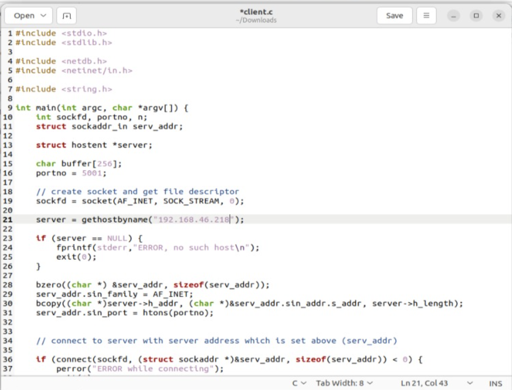
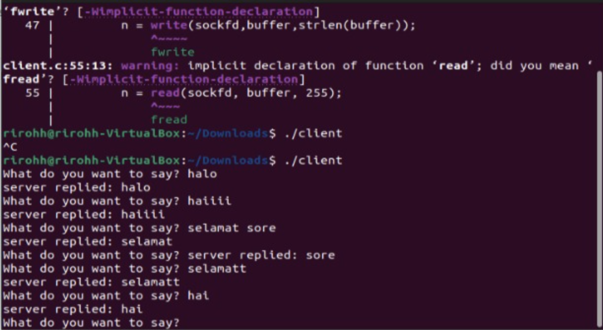
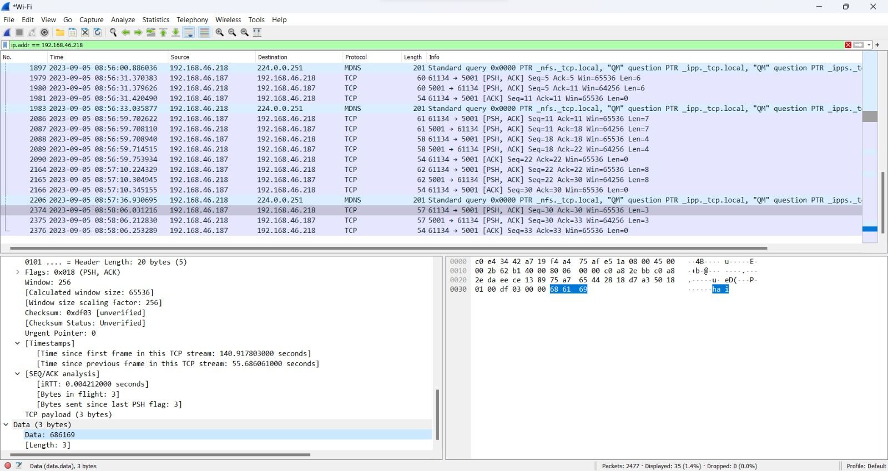
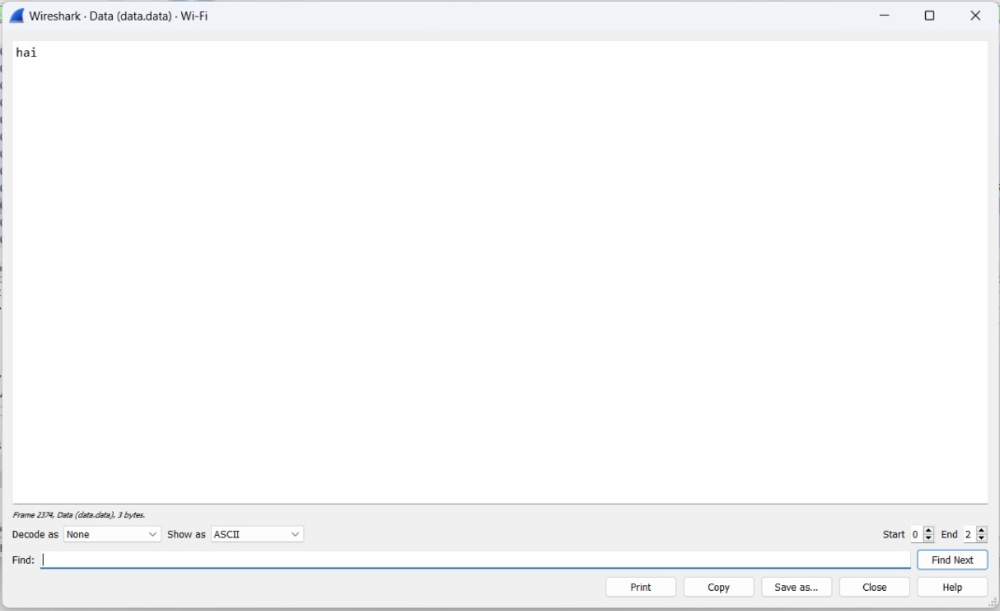
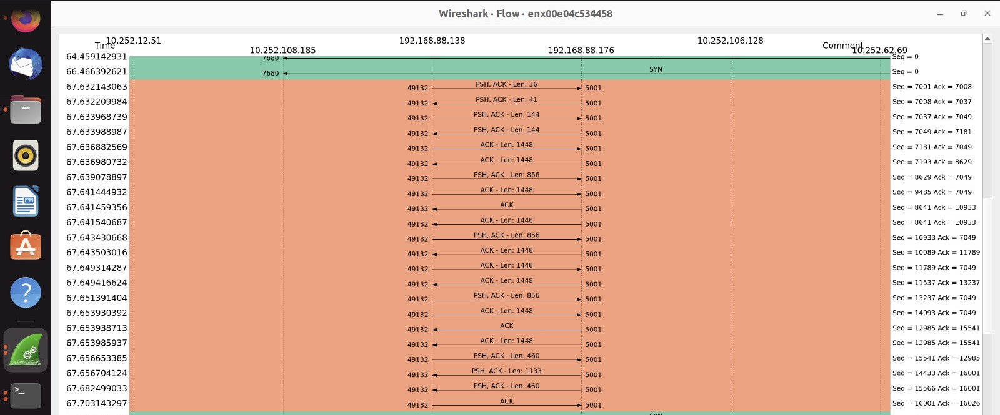

## Socket Server dan Client

### Socket Programming
Socket merupakan teknologi yang digunakan dalam komunikasi jaringan komputer yang memungkinkan komputer untuk berkomunikasi satu sama lain melalui sebuah jaringan. Socket programming sebdiri adalah portokol yang mempunyai metode untuk membuat koneksi tersebut. Tujuan dari socket programming adalah agar satu program bisa berinteraksi dengan program lainnya melalui jaringan menggunakan socket.

Socket programming dapat menggunakan protokol yang berbeda tergantung dengan jenis komunikasi yang dilakukan. Dua Protokol yang paling umum digunakan adalah:
- TCP/IP: digunakan untuk aplikasi yang memerlukan pengiriman data yang handal dan aman karena koneksinya yang lebih terjamin.
- UDP/IP: digunakan untuk aplikasi yang memerlukan latensi rendah seperti media streaming dan game online karena karakteristiknya yang cepat tapi tidak menjamin keutuhan data.

Pada Umumnya socket programming melibatkan dua komponen utama yaitu socket server dan socket client.

### Server
Socket server adalah program yang berjalan pada komputer/perngakat yang bertindak sebagai host untuk menerima permintaan koneksi dari client. Socket server selalu aktif dan menunggu permintaan koneksi datang dari socket client. Server mendengarkan di alamat IP dan port yang sudah ditentukan. Setelah menerima permintaan dari socket client, koneksi dapat dibentuk dan komunikasi dapat dilakukan antara server dan client; server dapat mengelola banyak koneksi dari socket client secara bersamaan. 

#### Penjelasan kode
Berdasarkan kode socket programming untuk server, program tersebut berfungsi untuk membuat sebuah server sederhana yang dapat menangani beberapa klien. Server akan mendengarkan dari port yang ditentukan pada program dan akan menangani klien yang terhubung ke child processnya.

- bzero: Funsi ini digunakan untuk menginisialisasi sejumlah byte di lokasi memori yang diberikan dengan nilai 0.
- bcopy: Fungsi ini digunakan untuk mennyalin data dari satu lokasi memori ke lokasi memori lainnya.
- init_sockaddr_in:Fungsi ini digunakan untuk menginisialisasi struktur sockaddr_in yang digunakan untuk menyimpan alamat(seperti IP dan socket) server.Fungsi ini mengalokasikan memori untuk struktur sockaddr_in, mengatur nilai-nilai awalnya, dan mengembalikan pointer ke struktur tersebut.
- process_operation:Fungsi ini menerima input string dan mengembalikan salinannya dengan alokasi memori yang baru. Fungsi ini digunakan untuk memproses operasi yang diterima dari klien.
- main:Fungsi utama dari program, di mana server socket dan proses utama berjalan. Pada fungsi ini dilakukan bebepa langkah yang berbeda. Pertama, socket dibuka menggunakan socket() dengan domain AF_INET dan tipe SOCK_STREAM. Kemudian, dibuat struktur sockaddr_in untuk alamat server dan mengikat socket ke alamat tersebut menggunakan bind(). Setelah itu, server mulai mendengarkan koneksi masuk dengan listen(). Loop utama dijalankan untuk menerima koneksi dari klien dan memprosesnya pada cild prses yang terpisah.
- Child Process: Setiap ada klien baru yang membuat koneksi, server akan melakukan forking dan membuat sebuah child processs baru. Jika klien mengirim string *close*, maka koneksi akan ditutup, dan jika setelah 5 detik tidak ada data yang diterima, maka akan dianggap terjadi koneksi timeout. Child process ini akna terus berjalan selama koneksi belum ditutup ataua terjadi sebuah kesalahan.

### Client
Socket client adalah program yang berjalan pada komputer/perangkat yang terhubung pada server, menjadi pembuat permintaan akan koneksi ke server menggunakan alamat IP dan port yang sesuai. Saat koneksi terbentuk antara klien dan server, klien dapat mengirim request maupunt data kepada server dan dapat menerima respons dari server. Karena seringkali client yang pertama kali mengirim permintaan akan koneksi kepada server, ia cenderung berperan sebagai inisiator dalam sebuah komunikasi.

#### Penjelasan Kode
Fungsi dari kode pada program client unutk membuat klien yang dapat terhubung ke server yang berjalan pada alamat IP dan port tertentu.
- Variabel-variabel:
    - sockfd: File descriptor untuk socket klien.
    - portno: Port yang akan digunakan untuk menghubungkan ke server 
    - serv_addr: Struktur sockaddr_in yang digunakan untuk menyimpan alamat server.
    - server: Pointer ke struktur hostent yang digunakan untuk menyimpan informasi host/server.
- socket(AF_INET, SOCK_STREAM, 0): Membuat soket dengan domain AF_INET dan tipe SOCK_STREAM.
- inisialisasi alamat server dengan mengisi struktur serv_addr dengan alamat IP yang hendak dituju dan port number-nya.
- connect(sockfd, (struct sockaddr *)&serv_addr, sizeof(serv_addr)): Mencoba untuk membuat koneksi ke server yang ditentukan dengan socket yang telah dibuat sebelumnya. Jika koneksi berhasil, klien akan terhubung ke server.
- Loop utama: Pada loop utama ini terjadi beberapa hal. Pertama, klien akan meminta user untuk menginptukan pesan yang mau dikirimkan ke server. Pesan tersebut  akan disimpan pada buffer, yang kemudian akan dikirim ke server menggunakan perintah *write();*. Setelah mengirim pesan, klien akan membaca respons dari server menggunakan *read()* dan menampilkannya di layar. Loop akan diakhiri ketika server mengirim pesan quit; pada saat itu juga klien akan keluar.

### Proses Komunikasi Socket Client dan Server
Source code server.c dan client.c dapat diakses di https://github.com/ferryastika/socket-programming-simple-server-and-client. Beberapa bagian dari kode perlu diubah seperti alamat IP yang dituju oleh client pada client.c. Untuk menjalankan program socket, dapat melalui terminal Linux maupun melalui terminal WSL setelah menjadikan file .c menjadi sebuah executable file. Agar program client dapat dijalankan dengan sukses, server harus dijalankan terlebih dulu, jika tidak, akan terjadi eror karena alamat yang dituju oleh client tidak dapat diakses.

Berikut proses dari komunikasi antara client dengan server pada perangkat. 
1. Inisialisasi server. Program socket server dijalankan agar dapat mendengarkan permintaan koneksi dari client.
2. IP address server yang dituju ditentukan oleh client.

3. Client mengirimkan permintaan koneksi ke server melalui program dan mengirimkan data setelah terhubung.

4. Server mendengarkan client dan merespon kembali ketika menerima data/request.

Dapat dilihat di bawah bahwa client mengirimkan packet denagn flag PSH(push) yang menanndakan bahwa data yang ada dalam buffer pengirim harus segra disampaikan ke lapisan aplikasi penerima tanpa menunggu buffer penerima terisis penuh ata menggabungkan data dalam buffer.

Karena packet yang dikirim menyimpan data berupa teks, isi dari packet tersebut dapat dilihat dengan pilhan Show Packet Bytes.

Untuk dapat di-*trace* melalui wireshark, aplikasi wireshark harus dijalankan di salah satu perangkat yang menjadi server atau client, kecuali menggunakan perangkat *tapping*.

Karena komunikasi antara klien-server dijalankan menggunakan TCP, data yang dikirimkan akan dibagi menjadi segmen-segmen yang ukurannya berbeda-beda tergantung beberapa faktor berbeda. Ukuran maksimum yang dapat dikirimkan oleh soket berbasis TCP adalah MSS(Maximum Segment Size), yang ditentukan oleh sistem operasi yang digunakan dan jaringan. Nilai MSS biasanya berkisar 1500 byte pada sebuah jaringan ethernet. Akan tetapi hal-hal lain seperti MTU(Maximum Transmission Unit), buffer internal, dan algoritma Nagle yang dapat memengaruhi ukuran dari setiap segmen, sehingga ukuran segmen yang dikirimkan dapat terlihat random/acak. Contohnya pada pengiriman sebuah data besar(melebihi 1500 bytes secara total), segmentasi yang terjadi terlihat berukuran cukup acak, seperti yang dapat dilihat pada flowgraph di bawah ini:

