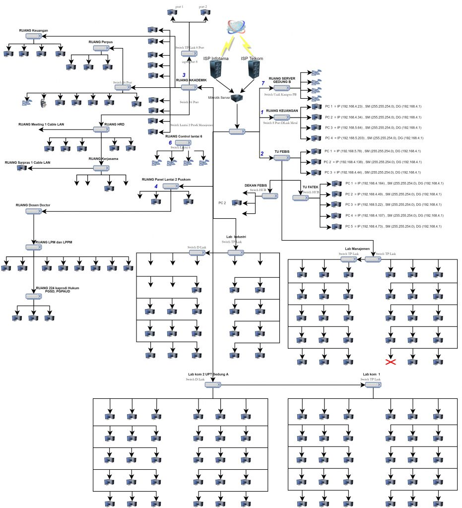
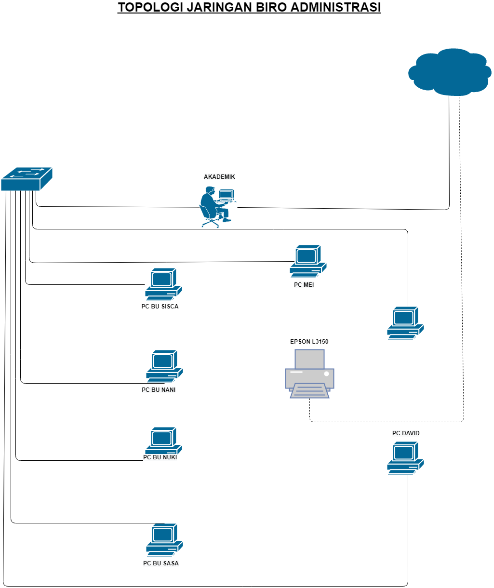
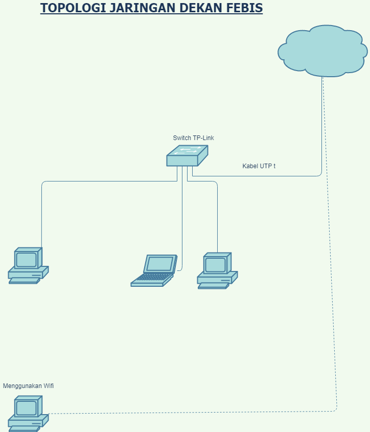
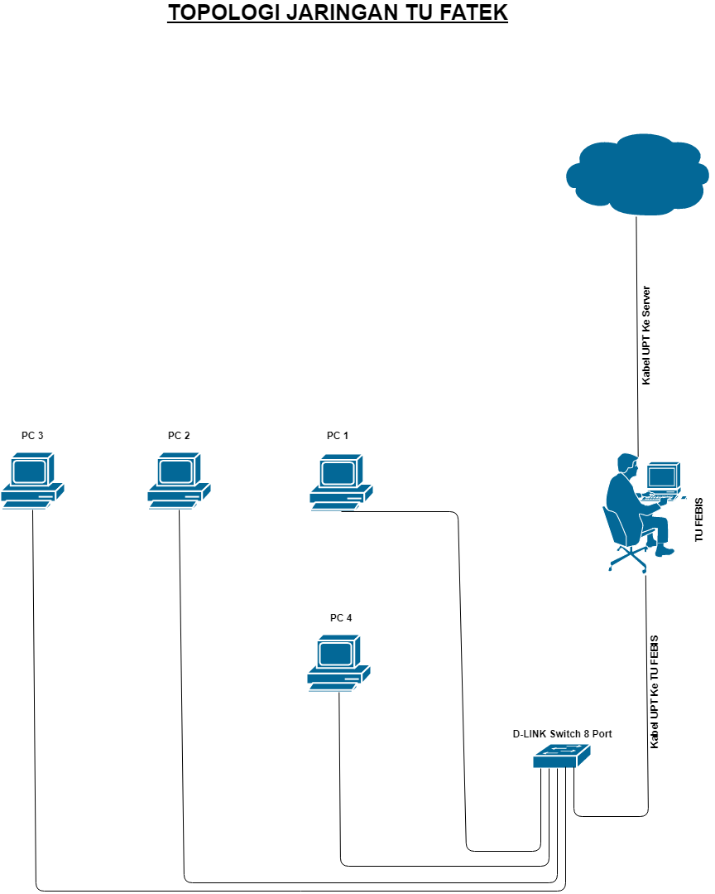
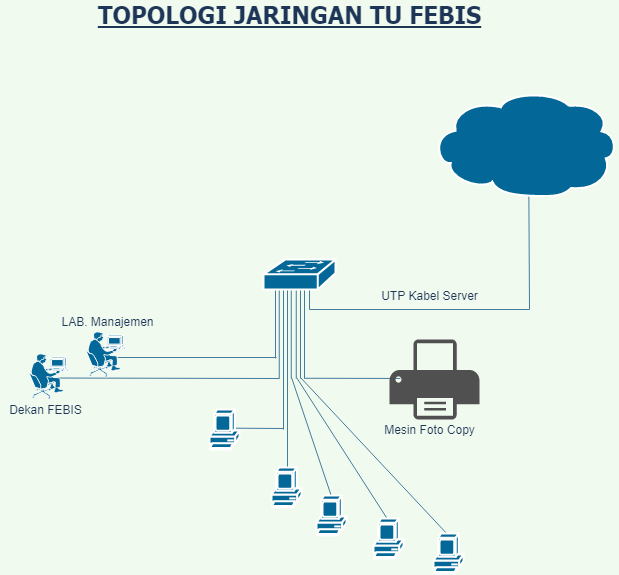
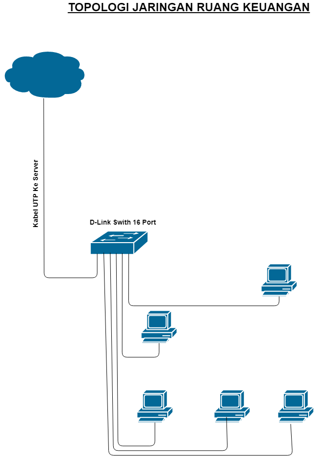
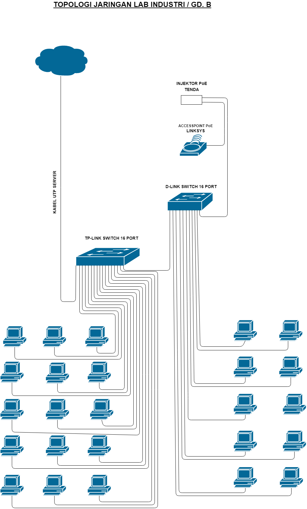
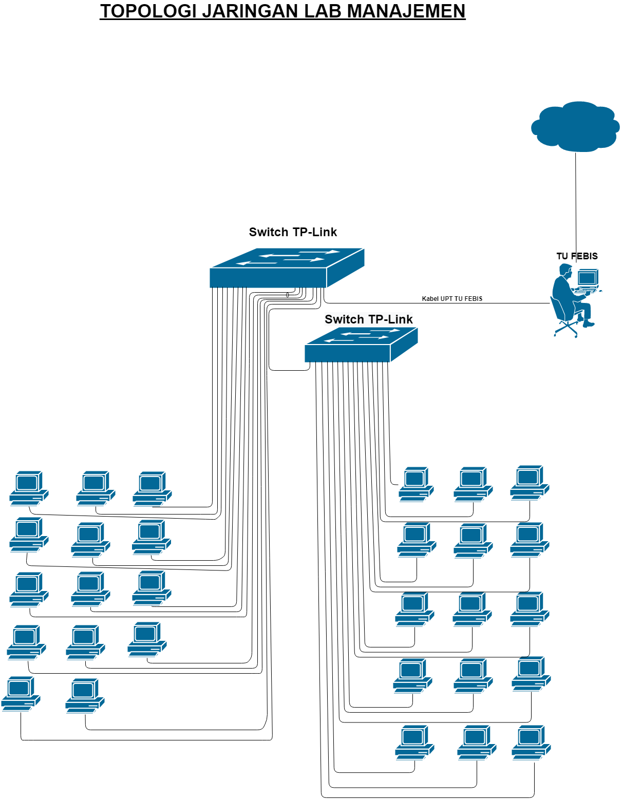
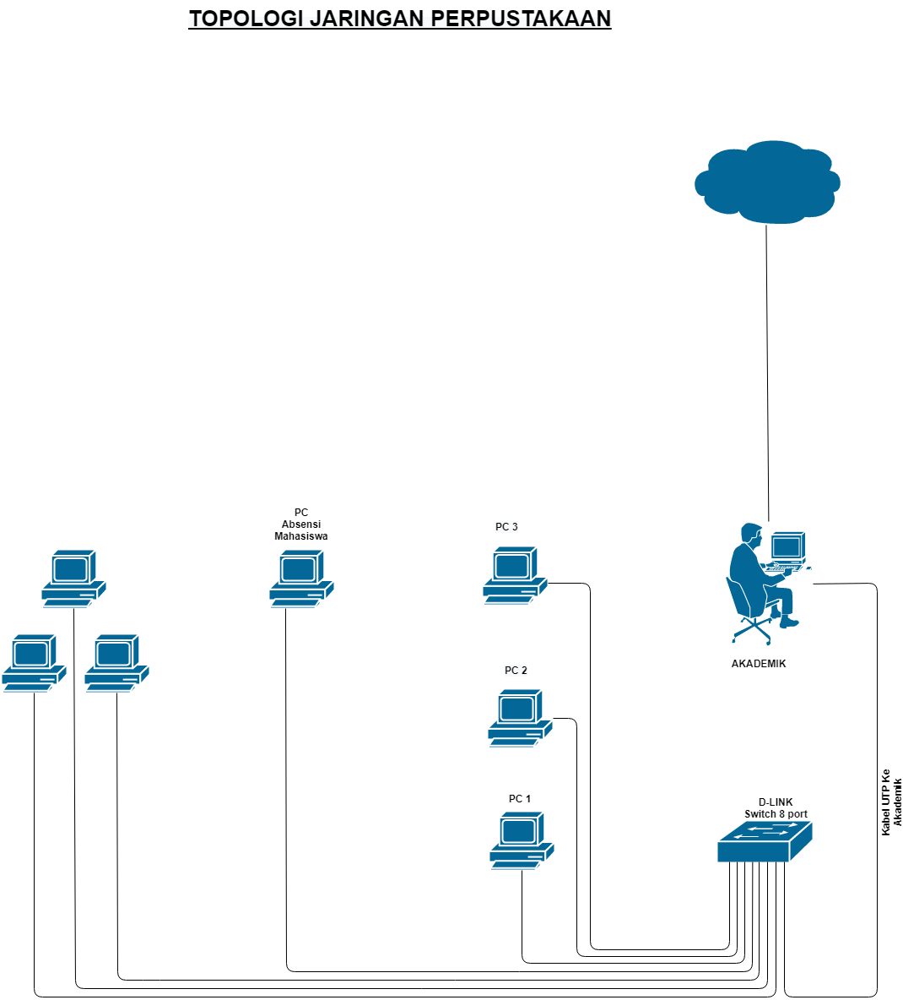

`Tugas ini merupakan tugas mata kuliah konsep jaringan  yang di bimbing oleh Bpk. Ferry Astika S`

# Arsitektur Jaringan Kampus
## Pendahuluan

Fundamental untuk mendukung konektivitas, keamanan, dan kinerja di konteks pendidikan, arsitektur jaringan kampus menjadi pondasi vital. Dalam memilih arsitektur, perlu mempertimbangkan kebutuhan pengguna, pertumbuhan, dan integrasi teknologi terbaru. Di sini akan dibahas arsitektur jaringan kampus yang umum dan populer.

## 1. Topologi Jaringan
Topologi yang sering diterapkan adalah bintang, di mana semua perangkat terhubung langsung ke pusat atau pusat pengelolaan jaringan. Kelebihannya termasuk kemudahan pengelolaan dan isolasi masalah.

## 2. Segmen Jaringan
Jaringan kampus biasanya terbagi menjadi segmen berdasarkan fungsi atau lokasi fisik:

- **Segmen Akademis**: Meliputi kelas, perpustakaan, dan laboratorium.
- **Segmen Administratif**: Mengelola data pegawai dan operasional.
- **Segmen Mahasiswa**: Menangani akses layanan kampus untuk mahasiswa.

## 3. Akses Nirkabel
Akses nirkabel menjadi bagian penting dalam jaringan kampus modern. Poin akses WiFi ditempatkan secara strategis untuk menangani konektivitas di area publik dan kelas kampus.

## 4. Keamanan Jaringan
- **Firewall**: Diposisiskan di pintu gerbang jaringan untuk mengendalikan lalu lintas.
- **Sistem Deteksi Intrusi (IDS) dan Sistem Pencegahan Intrusi (IPS)**: Melindungi jaringan dari ancaman.
- **VPN**: MMenjamin keamanan akses dari luar kampus.

## 5. Data Center
Pusat data kampus bertugas mengelola penyimpanan data, aplikasi, dan sumber daya pusat lainnya. Penggunaan virtualisasi sering diterapkan untuk meningkatkan efisiensi dan fleksibilitas.

## 6. Koneksi Luar Kampus
Koneksi ke internet dan kolaborasi dengan institusi atau organisasi lain merupakan elemen penting dalam arsitektur jaringan kampus. Sambungan harus memenuhi kebutuhan lalu lintas data dan menjamin kecepatan tinggi serta ketersediaan.

## 7. Monitoring dan Pengelolaan
Sisitem monitoring dan manajemen jaringan terintegrasi untuk memantau kesehatan jaringan, mendeteksi masalah, dan memberikan respons cepat terhadap peristiwa yang dapat memengaruhi kinerja.

## Contoh Topologi Jaringan
Berikut adalah contoh topologi jaringan kampus milik Universitas Pelita Bangsa:

### 1. Topologi Jaringan Kampus UPB

 
<i>Gambar: topologi jaringan umum di UPB.</i>

### 2. Topologi Ruang Admin

 
<i>Gambar: topologi jaringan di area administratif kampus.</i>

### 3. Topologi Ruang Dekan Febis

 
<i>Gambar: topologi jaringan di ruang dekan Fakultas Ekonomi & Bisnis.</i>

### 4. Topologi Fakultas Teknologi

 
<i>Gambar: topologi jaringan di Fakultas Teknologi.</i>

### 5. Topologi Fakultas Ekonomi & Bisnis

 
<i>Gambar: topologi jaringan di Fakultas Ekonomi & Bisnis.</i>

### 6. Topologi Ruang Keuangan

 
<i>Gambar: topologi jaringan di ruang keuangan kampus.</i>

### 7. Topologi Lab Industri

 
<i>Gambar: topologi jaringan di laboratorium industrii.</i>

### 8. Topologi Lab Manajemen

 
<i>Gambar: topologi jaringan di laboratorium manajemen.</i>

### 9. Topologi Perpustakaan

 
<i>Gambar: topologi jarignan di perpustakaan kampus.</i>

## Kesimpulan
Arsitektur jaringan kampus yang efektif menjadi kunci dalam mendukung kegiatan pendidikan dan administratif. Dengan merancang jaringan yang dapat berkebmang, aman, dan responsif, institusi dapat memastikan bahwa infrastruktur teknologi memeberikan dukungan maksimal bagi seluruh komunitas kampus.
---

**Referensi:**
[Topologi Jaringan Kampus UPB](https://puskom.pelitabangsa.ac.id/topologi-jaringan-kampus/)